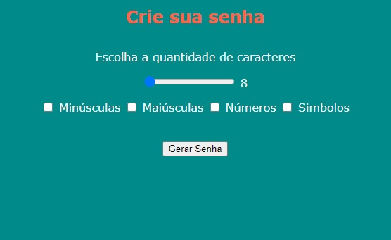
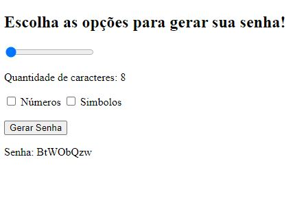

# GERADOR DE SENHAS :closed_lock_with_key: 
---

### App JavaScript para gerar senhas aleatórias com letras, números e símbolos.

---

O aplicativo gera senhas aleatórias com no mínimo 8 caracteres e no máximo 30 caracteres, senhas com maiúsculas e minúsculas, caracteres numéricos, alfanuméricos e especiais podem ser gerados.

### :books: Como usar?

> 1. Use o controle deslizante para escolher o número de caracteres.
> 2. Escolha os caracteres que irão compor a senha.
> 3. Clique no botão para gerar a senha.

---
#### :on: Versão 1.2

https://user-images.githubusercontent.com/75145389/111730240-bc6d3680-884f-11eb-952d-5c7b798ac544.mp4

#### :soon: Próximos passos

* Resolver slider mudando de posição quando passa para 2 algarismos
* Implementação do Bootstrap

---
#### 🔚: Versão 1.1

#### :heavy_check_mark: Feito

* Resolver slider mudando de posição quando passa para 2 algarismos
* ~~Implementar botão com CSS~~
* ~~Implementar verificação de senha força da senha gerada~~

---
#### :end: Versão 1.0

#### :heavy_check_mark: Feito

* ~~Implementar front-end.~~
* ~~Separar maiúsculas e minúsculas do código JS para gerar senhas exclusivas com esses dois tipos.~~
* ~~Adicionar caixas de seleção para maiúsculas e minúsculas.~~
---
#### :bust_in_silhouette: Autor

 **Wivson Machado**

* Twitter: [@Wivson_Machado](https://twitter.com/Wivson_Machado)
* Github: [wivsonmachado](https://github.com/wivsonmachado)

#### :busts_in_silhouette: Contribuição

Sinta-se a vontade para contribuir com o código, crie issues e pull requests 
